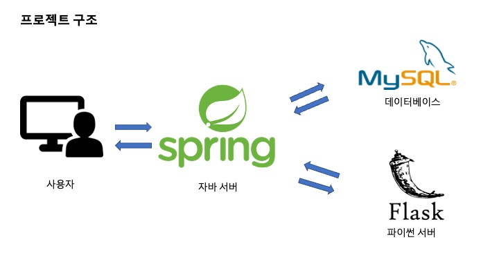
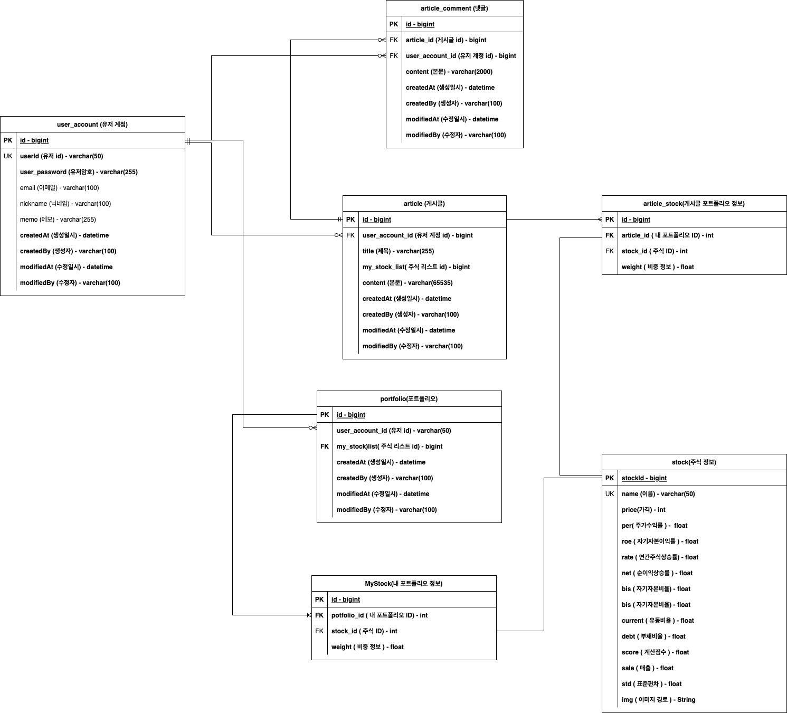
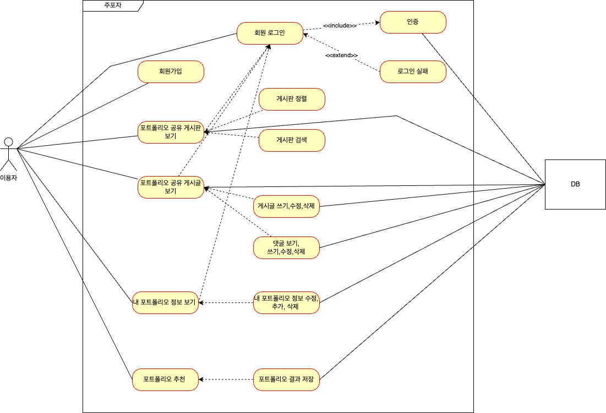

# JUPOZA

<br>
주식 분산투자에 어려움을 겪는 주식 투자자들을 위한 <b>주식 포트폴리오 자문 서비스</b> 

## 데모페이지
* http://64.110.84.9:8080/

## 프로젝트 설명 
- 투자자의 입장에서 각 개인의 스타일에 맞게 투자할 수 있도록 투자 설계에 도움을 주고자 한다.
- 주식 종목들의 기술적 분석을 통해 투자자에게 기업의 성향을 키워드별로 카테고리를 구분하여 제안한다. 
- 사용자들에게 포트폴리오 구성과 종목에 비중을 선택할 때에 도움을 준다. 
- 포트폴리오 구성에 어려움을 느끼거나 효과적으로 구성하려는 투자자들을 대상으로 서비스 제공한다.

## 주요 기능 
- 포트폴리오 구성에 도움을 주는 서비스 
  - 사용자에게 성향에 포트폴리오를 구성할 수 있도록 카테고리별로 주식을 선택할 수 있습니다.
  - RiskParity 자산배분 모형을 이용해 사용자는 가장 최적의 포트폴리오 비중을 제안 받습니다.
  - 사용자는 포트폴리오에 대한 시각화된 정보를 제공 받습니다.
- 내 포트폴리오 관리 기능 
  - 사용자는 내 포트폴리오를 등록할수 있고 수정, 삭제를 할 수 있습니다.
- 포트폴리오 공유 게시판 기능
  - 사용자들 끼리 포트폴리오를 공유할 수 있습니다. 

### 1) 카테고리별 기준
- 저평가     - 시장에서 비교적 저평가되어 있는 기업들을 PER, ROE 를 기준으로 검색합니다.
- 성장률     - 해당 기업이 얼마나 성장했는지를 연간 순이익 상승률을 기준으로 검색합니다.
- 배당 수익률 - 기업이 얼마나 배당을 하는지를 검색할 수 있습니다.
- 안정성     - 기업이 재무상태가 얼마나 탄탄한지 자기자본비율, 유동비율,  당좌비율, 부채비율로 점수를 매겼습니다.
- 고위험     - 기업의 변동성이 높은 순으로 검색할 수 있습니다.

### 1) RiskParity 모델을 사용한 이유 
- 변동성이 큰 현재 주식 시장에서 안정성이 높은 비중을 제안한다.
- 마코위츠 평균 분산 모델은 평균과 분산 입력치에 추정 오차가 발생할 수 있음.
- 추정오차는 줄이고, 분산투자 정도가 커지는 효과
- 기대수익률 예측 오차를 피할 수 있으며, 시가총액 가중방식에서 나타나는 편중현상에서 벗어날 수 있음.
- 수익률보단 안정성에 집중해서 초보 투자자에게 적합한 안정적인 투자 방법

# 프로젝트 구조 

* Spring Boot Server - 스프링 부트를 이용해 웹 서버 역할은 한다. 
* DB - 주식 데이터, 회원정보 데이터, 포트폴리오 데이터, 게시판 데이터를 관리한다.
* Flask Server - 주식 데이터를 전처리 하고 스프링 부트 서버에서 포트폴리오 비중을 구하는 요청이 들어오면 RiskParity 모델을 사용해 비중을 반환한다.


## 데이터베이스 Erd


## 유즈 케이스 



## 설치

### 1. 프로젝트 불러오기

```sh
git clone https://github.com/TeamJupoza/Jupoza.git
```

### 2. /main/resource 에 application.yaml 파일 생성후 환경값 입력 (DB 연결 설정)

```sh
# 해당 내용을 application.yaml 에 입력해 주세요.

spring:
  datasource:
    # url
    url: jdbc:mysql://'mysql 호스트 주소':3306/JUPOZA?serverTimezone=Asia/Seoul&characterEncoding=UTF-8
    # user
    username: 'id'
    # password
    password : 'password'
    # mysql-driver connector
    driver-class-name: com.mysql.cj.jdbc.Driver

```

### 3. Jupoza DB 생성 & Table 생성

#### 1. Jupoza Database 생성
```sh
CREATE DATABASE jupoza;
```

### 2. 데이터 전러치  
* document 폴더의 JupozaDataPreProcessing.ipynb 프로그램을 이용해 재무주가 데이터를 전처리
* 전처리된 데이터를 stock 테이블에 삽입해야한다.
* sampleStock.sql 참조(2022.11월 기준 샘플자료)
```sh
 # Jupoza DB에 stock 테이블 추가 
 CREATE TABLE `stock` (
  `stockid` int NOT NULL,
  `bis` float NOT NULL,
  `current` float NOT NULL,
  `debt` float NOT NULL,
  `dividend` float NOT NULL,
  `img` varchar(255) DEFAULT NULL,
  `name` varchar(255) DEFAULT NULL,
  `net` float NOT NULL,
  `per` float NOT NULL,
  `price` int NOT NULL,
  `quick` float NOT NULL,
  `rate` float NOT NULL,
  `roe` float NOT NULL,
  `sale` float NOT NULL,
  `score` float NOT NULL,
  `std` float NOT NULL,
  PRIMARY KEY (`stockid`)
) ENGINE=InnoDB DEFAULT CHARSET=utf8mb4 COLLATE=utf8mb4_0900_ai_ci;
 ```


### 3. Gradle Build
```sh
 # /Jupoza 디렉터리에서 명령어 실행 
 ./gradlew build
 ```

### 4. Jar 파일 실행
```sh
 # ~/Jupoza/build/libs 디렉터리에서 Jar 파일 실행
 java -jar --spring.profiles.active=deploy ["빌드된 jar 파일"] 
```
### 6. Jupoza_python 실행
```sh
# /Jupoza_python
 python3 app.py 
```

# 관련 링크

1. Jupoza_Python(플라스크 서버)
   - https://github.com/devMs94/Jupoza_python
2. Jupoza_App
   - https://github.com/kkkmj/jupoja
   
# 개발 환경
* Java 11
* Intellij IDEA Ultimate 2022.2.2
* Gradle 7.5.1
* Spring Boot 2.7.5
* Python 3.9


# 기술 세부 스택 
* Spring Boot
  * Spring Web
  * Srping Data Jpa
  * Thymleaf
  * Spring Security
  * MySQL Driver
  * Lombok
  * Spring Boot DevTools
  * Jwt
  
* Python
  * Flask
  * numpy
  * pandas
  * scipy
  * openpyxl


* JavaScript
  * Bootstrap 4
  * Jquery
  * datatables
  * chartJs
  * Ajax
    
# Team
가천대학교 컴퓨터공학과 
- 유민상 : 웹사이트 개발 
- 김민조 : 웹사이트 개발  앱 개발 
- 김종구 : 데이터 전처리 
- 황윤기 : 데이터 전처리 
- 최범수 : 파이썬 서버 개발 , 데이터 전처리


# 프로젝트 고도화
프로젝트에 추가 기능과 UI를 붙여서 리뉴얼 한다.
* 유즈케이스 , 도메인 설계 내역 작성 
* 회원기능
  * 스프링 Security 활용 
* 포트폴리오 공유 게시판
  * JPA를 이용해 페이징, 정렬, 검색, CRUD 수행 
* UI / UX 수정
  * 좀더 가독성 있고 깔끔하게 수정 
* 내 포트폴리오 정보 (CRUD)
  * 나의 포트폴리오 정보를 저장 수정 삭제 할 수있다.
* 주식 데이터 동적으로 변경 
  * 현재 정적인 데이터를 API를 활용해 동적으로 변경해서 최신정보 반영 
* 코드 리팩토링
  * 비효울적인 코드들을 리팩토링해 효율적이고 가독성 있게 변경 
  
  
  # 프토젝트 1차 고도화 완료 (Release v1.0)
  
  * 프로젝트 유즈케이스, ERD 문서작성
  * 내 포트폴리고 정보 구현 완료 
  포트폴리오 종목 5개를 선택하고 DB에 내 포트폴리오를 저장 수정 삭제 출력이 가능함
  * 포트폴리오 공유 게시판 구현완료
  내 포트폴리오를 소개할 수 있도록 포트폴리오 공유 게시판을 구현함
  * 회원기능 구현 완료
  내 포트폴리오 관리, 포트폴리오 공유 게시판을 관리 할 수 있도록 회원기능 구현 완료 
